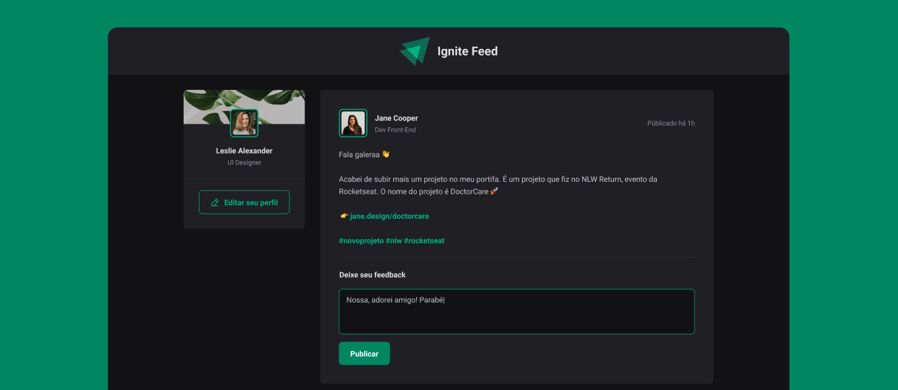

# Aulas Ignite React 2023 

Repositório destinado a armazenar todas as resoluções dos desafios que desenvolvi juntamente com o link para o vídeo no meu canal onde desenvolvo do zero a resolução explicando alguns conceitos do projeto.

 

&nbsp;

## Fundamentos do ReactJs

Nesse módulo, criaremos uma aplicação React utilizando o Vite e aprenderemos sobre os conceitos mais importantes do React, entre eles estão componentização, propriedades, estados, imutabilidade e hooks, além de aplicar o TypeScript no nosso projeto para adicionar tipagem estática à aplicação.

### 🛠️ Nesse projeto foi utilizado

* Vite
* CSS Modules
* Typescript

 

&nbsp;

## Criando SPAs com ReactJS

Nesse módulo iremos construir uma aplicação completa com roteamento e diversos conceitos importantes do ecossistema React como ContextAPI, useReducer, immer e muito mais.

### 🛠️ Nesse projeto foi utilizado

* Vite
* Styled Components
* Local Storage
* Typescript
* Context API
* React Router Dom
* React Hook Form
* Validações de formulário com Zod

 

&nbsp;

## Consumo de API e performance no ReactJS

Nesse módulo construiremos uma aplicação front-end web completa, conectando a uma API e veremos como performar aplicações com o React entendendo como funcionam os algoritmos internos da biblioteca e todo fluxo de renderização de componentes.

### 🛠️ Nesse projeto foi utilizado

* Vite
* Styled Components
* Typescript
* React Router Dom
* React Hook Form
* Axios
* API do Github

 

&nbsp;

&nbsp;

Feito com 💗 por Elizabete Fabri

